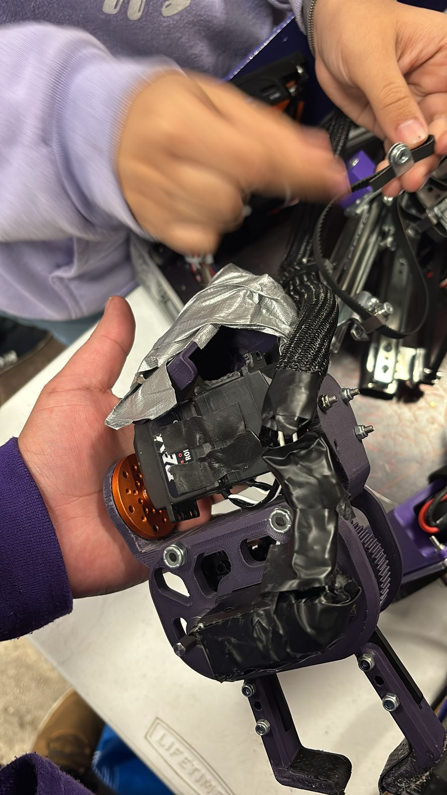
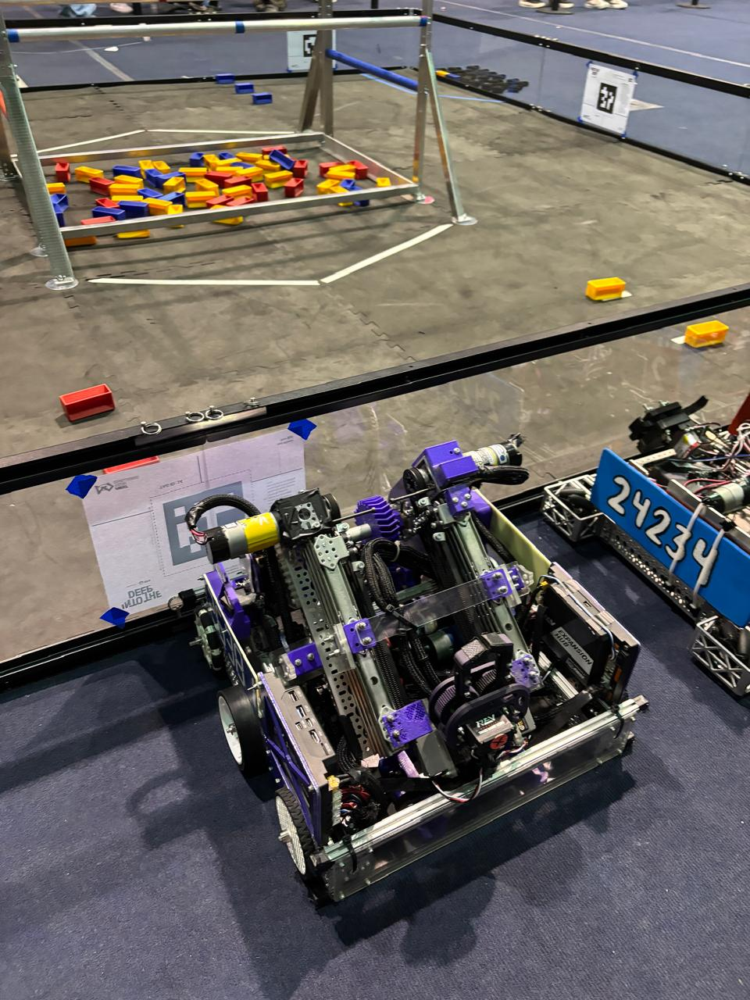

# **2025 INTO THE DEEP FTC Mexico Championship Recap**

## **Mexico Championship**

### **🟣 23619 Overture Purple**

- **Qualification Rank:** #9
- **Record:** 4-1-0
- **OPR:** 77.66
- Served as **Alliance Seed 7 Captain**, selecting **Botbusters White** as our alliance partner.
- **First official run** of our **IntoTheDeep Scouting App**, inspired by FRC2713's FRC scouting approach, bringing valuable data-driven insights to our competition strategy.
- Delivered an **excellent Inspire Award interview and pit responses**, demonstrating our engineering process, team culture, and outreach efforts.
- Carried on with our **"BELIEVE" philosophy**, keeping our spirits high and motivation strong throughout the event.
- **Playoff Performance:**
  - Advanced through **Lower Bracket Round 3 (Match 6)** before being eliminated.
  - Suffered an **elevator derailment** after getting stuck in the high basket during auton, affecting our final playoff run.
- **Significant Achievement:** Second year in FTC and served as **Alliance Seed 7 Captain**, marking a great milestone in our team's competitive journey.

---

### **⚪ 26381 Overture White**

- **Qualification Rank:** #19
- **Record:** 3-2-0
- **OPR:** 75.72
- Achieved a **high score of 161**, a highlight of our championship performance.
- Delivered an **excellent Inspire Award interview and pit responses**, showcasing our passion, technical expertise, and commitment to **FIRST values**.
- Continued to embrace the **"BELIEVE" philosophy**, maintaining determination and enthusiasm throughout the event.
- Despite not being selected as an alliance partner, we **proudly finished #19** among Mexico’s **best FTC teams**, a testament to our growth and performance.
- **Looking Ahead:** This experience has set the stage for **next year’s improvements**, and we are eager to come back stronger and more prepared for future challenges.

---

## **🏁 Closing Thoughts**

The **Mexico Championship** was an incredible experience that reinforced our love for **FTC and competitive robotics**. Both **Overture Purple and Overture White** showcased their hard work, resilience, and passion, competing among the top teams in the country. From refining our **scouting and strategy** to handling **mechanical setbacks** and **pushing through intense playoffs**, we leave this event with valuable lessons that will shape our future seasons.

We are **proud of our achievements**, from leading alliances to delivering strong **Inspire Award presentations**, and we recognize this as just another step forward in our journey as a **growing, competitive FTC program**. The belief in our potential remains stronger than ever, and we are **ready for the next challenge**!

💜⚪ **BELIEVE!** 🚀
