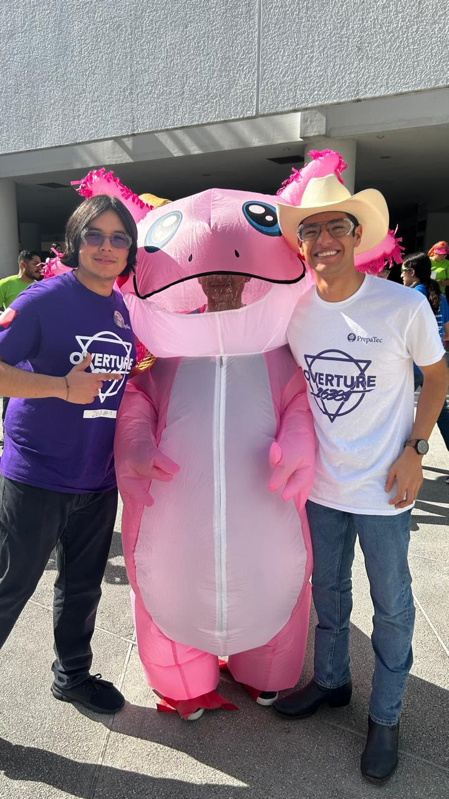

# **Monterrey Regional**

### **🟣 23619 Overture Purple**

- Robot name: "Diavel" inspired by The DUCATI Diavel Motorcycle.
- Due to time and practice constraints, we settled for climbing only the first level, ensuring more High Basket cycles.
- The claw mechanism had a fixed angle, prioritizing consistency over variability.
- We developed an autonomous routine for each starting location, guaranteeing at least two high basket samples.
- We held practice matches at our workshop against our teams, complementing each other’s strategies and driving improvements.
- Most of the final days before our first event were focused on optimizing fast High and Low basket cycles, enabling efficient grabbing from any section of the submersible.
- At the event, we carried on with our new **"BELIEVE" philosophy**, inspired by *Ted Lasso*, and hung a **"BELIEVE"** poster in our pit, which was signed by all team members.
- In preparation, we extensively practiced our **Inspire presentation** and **pit questions**, covering everything from team culture to detailed engineering explanations.
- We trained new members on pit operations and event workflow, ensuring that first-time attendees gained valuable hands-on experience.
- **Performance Summary:**
  - **Rank:** #24
  - **Record:** 1-4-0
  - **OPR:** 39.73
  - Selected as a partner of **Alliance Seed 4** with **VOLTEC Robotics Black**.
  - Advanced through the **Playoffs**, eliminated in **Lower Bracket Round 4 (Match 8)**.
  - **🏆 Won Second Place Inspire Award**.

  ### **📸 Photos**
  Here are some pictures from Diavel:

  
  *Close up of Diavel.*

  
  *Close up of Diavel.*

  
  *A picture of Overture White and Purple together*

  
  *Celebrating with VOLTEC BLACK a successful alliance.*

  
  *Overture White and Purple with an Axolotl*

  
  *The BELIEVE signed by all team members and mentors. Touched before every match and Inspre Interview*
  
  
  *A team member beside Valkyrie after celebrations!*

---

### **⚪ 26381 Overture White**

- Robot name: "Valkyrie"inspired by the HONDA Valkyrie Motorcycle.
- Due to time and practice constraints, we settled for climbing only the first level, ensuring more High Basket cycles.
- A complete redesign of the claw mechanism was done just days before the event, resulting in a **claw-like mechanism with a variable angle**, improving versatility.
- Like our sister team, we developed an autonomous routine for each starting location, guaranteeing at least two high basket samples.
- We held practice matches at our workshop against our teams, allowing us to refine our strategies and improve robot synergy.
- The final stretch of preparation was focused on optimizing fast High and Low basket cycles, with the ability to grab from any section of the submersible.
- The **"BELIEVE" philosophy** was a driving force for our team’s motivation, and we proudly displayed and signed our "BELIEVE" poster in the pit.
- We conducted **extensive Inspire presentation and pit question training**, preparing for discussions on team culture and technical aspects of our engineering process.
- First-time team members were trained on pit operations and event workflow to ease them into their **FIRST** career.
- **Performance Summary:**
  - **Rank:** #12
  - **Record:** 3-2-0
  - **OPR:** 66.62
  - Selected as a partner of **Alliance Seed 2** with **Botbusters White**.
  - Advanced through the **Playoffs**, reaching the **Finals**.
  - **Finals Match 2:** Lost against **Alliance Seed 1**.
  - **🏆 Won 1st Place Inspire Award, securing a spot at the Mexico Championship!**
  - Due to some teams already qualifying, we **generated a wildcard** that ensured Overture Purple’s qualification for the championship.

  ### **🎥 Robot Highlights**
  Here you may check some of the Highlights of the final design of the robot on these videos and photos:
   
   [26381 - High Basket Auton](https://youtu.be/Aqw6lpf_S9c)

   [26381 - High Chamber Cycles](https://youtu.be/U5xGTvAChXc)

   [26381 - High Basket Cycles](https://youtu.be/EkOIDSBfoP0)

### **📸 Photos**
Here are some pictures from Valkyrie:

Close up of Valkyrie.

A picture of Overture White and Purple together

Celebrating with BOTBUSTERS WHITE a successful alliance.

Overture White celebrating the Inspire Award.

After mounting the pit, team members tested the coziness!

The BELIEVE signed by all team members and mentors. Touched before every match and Inspire Interview

A team member beside Valkyrie after celebrations!

---

## **🏁 A Defining Event for Overture**

For both **Overture Purple and Overture White**, the Monterrey Regional was not just another competition—it was a defining moment in our journey through **FIRST and FTC**. We are extremley proud of the work from our members and mentors for the leap forward in sucess in our second year in the category.

We saw firsthand how FTC is more than just a robotics competition—it is a **platform for learning, growing, and inspiring the next generation of engineers and leaders**. Many of our members, especially our newcomers, had their first real taste of what it means to be part of a **FIRST event**: the **energy of the pit**, the **adrenaline of the matches**, the **intensity of judging**, and most importantly, the **camaraderie with other teams**. This experience deepened our passion for robotics, proving that hard work and dedication truly pay off. 

As a team, we learned that the **process is just as important as the result**. Whether it was iterating on mechanisms in the last few days, pushing through setbacks, or refining our presentations, each moment contributed to the growth of our members, our team, and our impact within the **FIRST community**.

---

## **🙌 Thank You to Our Community!**

We could not have done this without the support of the **amazing FTC community**, and we want to extend a huge **thank you** to:
- **VOLTEC Robotics Black** and **Botbusters White**, our incredible alliance partners, for trusting us and working together to achieve great results!
- All the **teams who competed**, bringing their best designs, strategies, and energy to the event.
- The **judges and volunteers** who made this event possible with their time, dedication, and passion for inspiring students in STEM.
- Our **mentors, coaches, and supporters** who were there through challenges and pushed us to be better every single day.

We are incredibly grateful for this journey, and we can’t wait to keep pushing forward towards **Mexico Championship**. This is only the beginning for **Overture Robotics**, and we are ready for whatever comes next!

💜⚪ **BELIEVE!** 🚀
