# **Monterrey Regional**

### **🟣 23619 Overture Purple**

- Robot name: "Diavel" inspired by The DUCATI Diavel Motorcycle.
- Due to time and practice constraints, we settled for climbing only the first level, ensuring more High Basket cycles.
- The claw mechanism had a fixed angle, prioritizing consistency over variability.
- We developed an autonomous routine for each starting location, guaranteeing at least two high basket samples.
- We held practice matches at our workshop against our teams, complementing each other’s strategies and driving improvements.
- Most of the final days before our first event were focused on optimizing fast High and Low basket cycles, enabling efficient grabbing from any section of the submersible.
- At the event, we carried on with our new **"BELIEVE" philosophy**, inspired by *Ted Lasso*, and hung a **"BELIEVE"** poster in our pit, which was signed by all team members.
- In preparation, we extensively practiced our **Inspire presentation** and **pit questions**, covering everything from team culture to detailed engineering explanations.
- We trained new members on pit operations and event workflow, ensuring that first-time attendees gained valuable hands-on experience.
- **Performance Summary:**
  - **Rank:** #24
  - **Record:** 1-4-0
  - **OPR:** 39.73
  - Selected as a partner of **Alliance Seed 4** with **VOLTEC Robotics Black**.
  - Advanced through the **Playoffs**, eliminated in **Lower Bracket Round 4 (Match 8)**.
  - **🏆 Won Second Place Inspire Award**.

  ### **📸 Photos**
  Here are some pictures from Diavel:

### **📸 Photos**
Here are some pictures from Diavel:

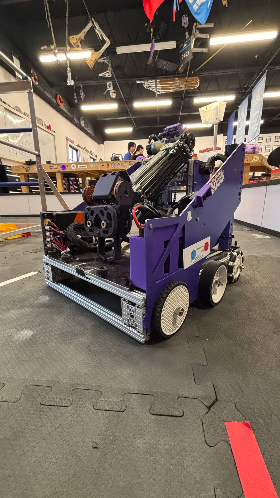

*Close up of Diavel.*

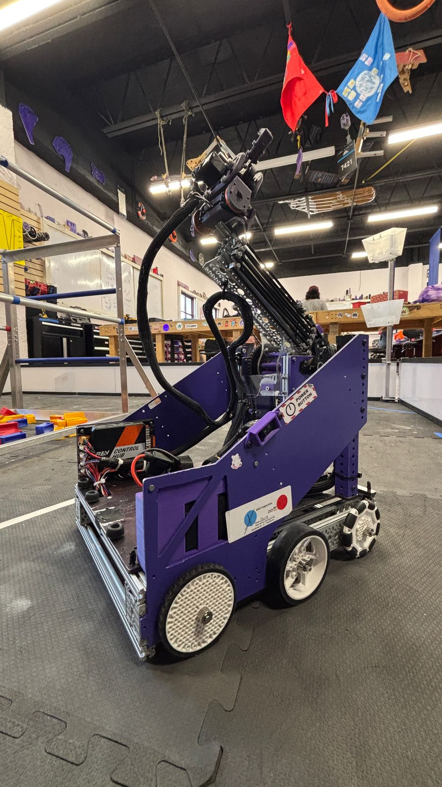

*Close up of Diavel.*

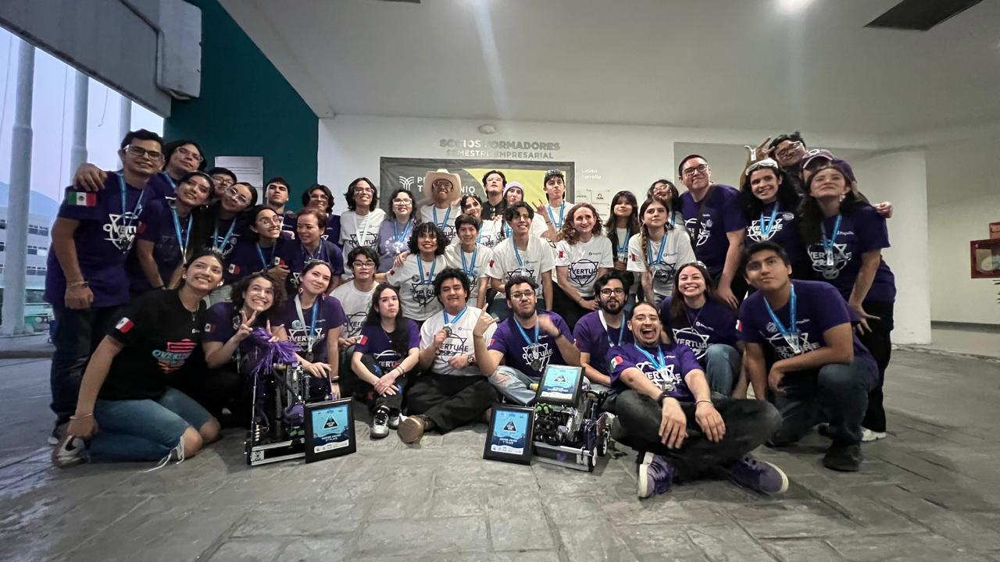

*A picture of Overture White and Purple together*

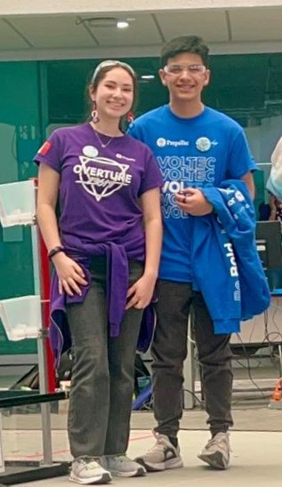

*Celebrating with VOLTEC BLACK a successful alliance.*

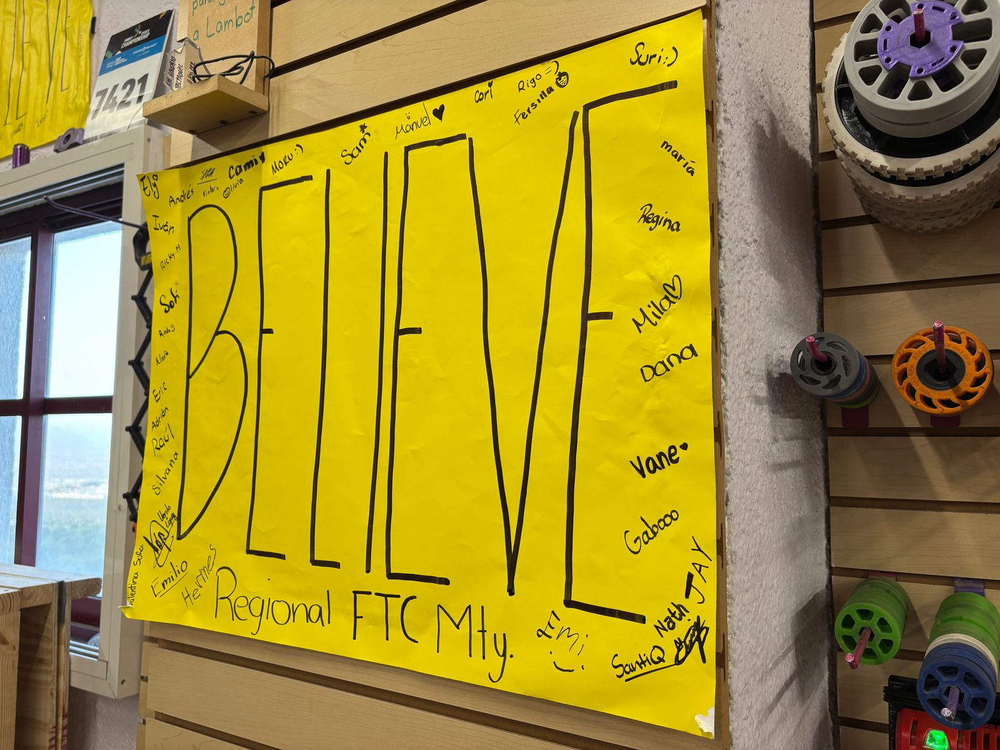

*The BELIEVE signed by all team members and mentors. Touched before every match and Inspire Interview*

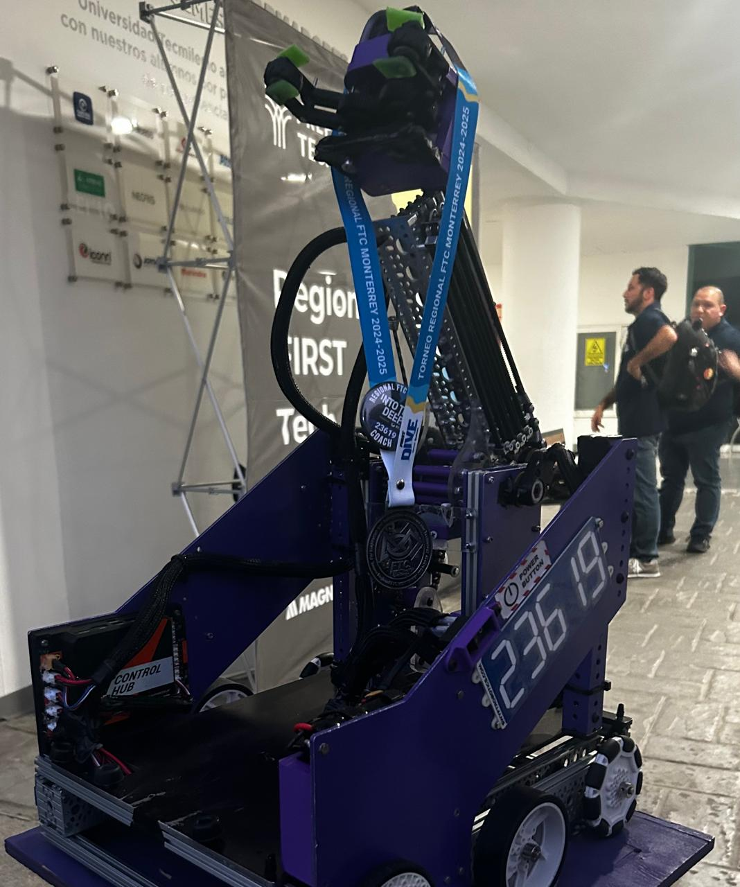

*Diavel posing triumphantly with its medal*

---

### **⚪ 26381 Overture White**

- Robot name: "Valkyrie"inspired by the HONDA Valkyrie Motorcycle.
- Due to time and practice constraints, we settled for climbing only the first level, ensuring more High Basket cycles.
- A complete redesign of the claw mechanism was done just days before the event, resulting in a **claw-like mechanism with a variable angle**, improving versatility.
- Like our sister team, we developed an autonomous routine for each starting location, guaranteeing at least two high basket samples.
- We held practice matches at our workshop against our teams, allowing us to refine our strategies and improve robot synergy.
- The final stretch of preparation was focused on optimizing fast High and Low basket cycles, with the ability to grab from any section of the submersible.
- The **"BELIEVE" philosophy** was a driving force for our team’s motivation, and we proudly displayed and signed our "BELIEVE" poster in the pit.
- We conducted **extensive Inspire presentation and pit question training**, preparing for discussions on team culture and technical aspects of our engineering process.
- First-time team members were trained on pit operations and event workflow to ease them into their **FIRST** career.
- **Performance Summary:**
  - **Rank:** #12
  - **Record:** 3-2-0
  - **OPR:** 66.62
  - Selected as a partner of **Alliance Seed 2** with **Botbusters White**.
  - Advanced through the **Playoffs**, reaching the **Finals**.
  - **Finals Match 2:** Lost against **Alliance Seed 1**.
  - **🏆 Won 1st Place Inspire Award, securing a spot at the Mexico Championship!**
  - Due to some teams already qualifying, we **generated a wildcard** that ensured Overture Purple’s qualification for the championship.

  ### **🎥 Robot Highlights**
  Here you may check some of the Highlights of the final design of the robot on these videos and photos:
   
   [26381 - High Basket Auton](https://youtu.be/Aqw6lpf_S9c)

   [26381 - High Chamber Cycles](https://youtu.be/U5xGTvAChXc)

   [26381 - High Basket Cycles](https://youtu.be/EkOIDSBfoP0)

### **📸 Photos**
Here are some pictures from Valkyrie:

  

    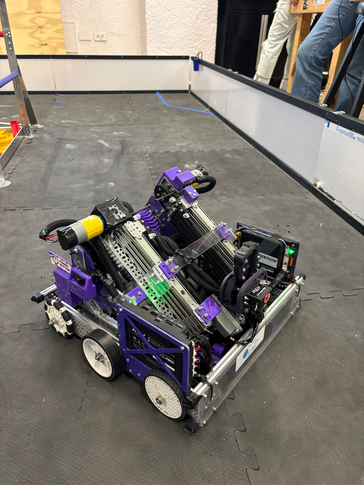
  

  

    
  

  

    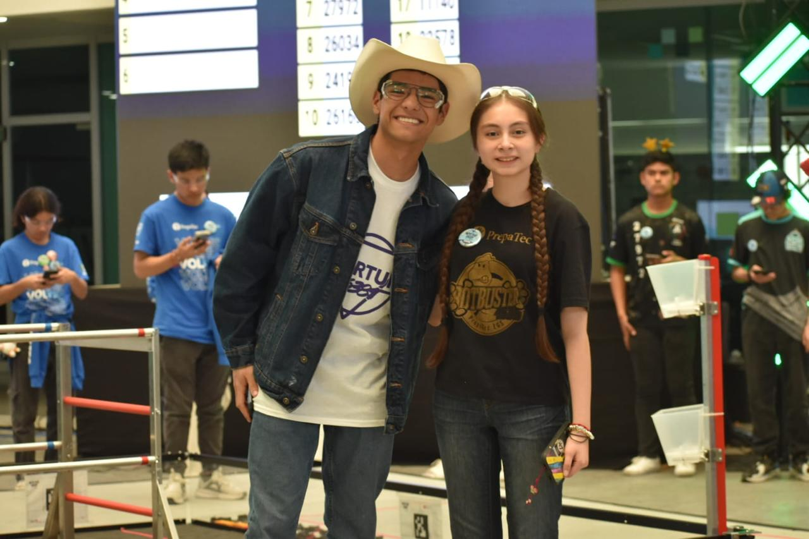
  

  

    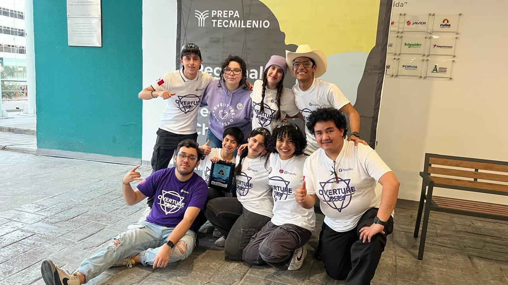
  

  

    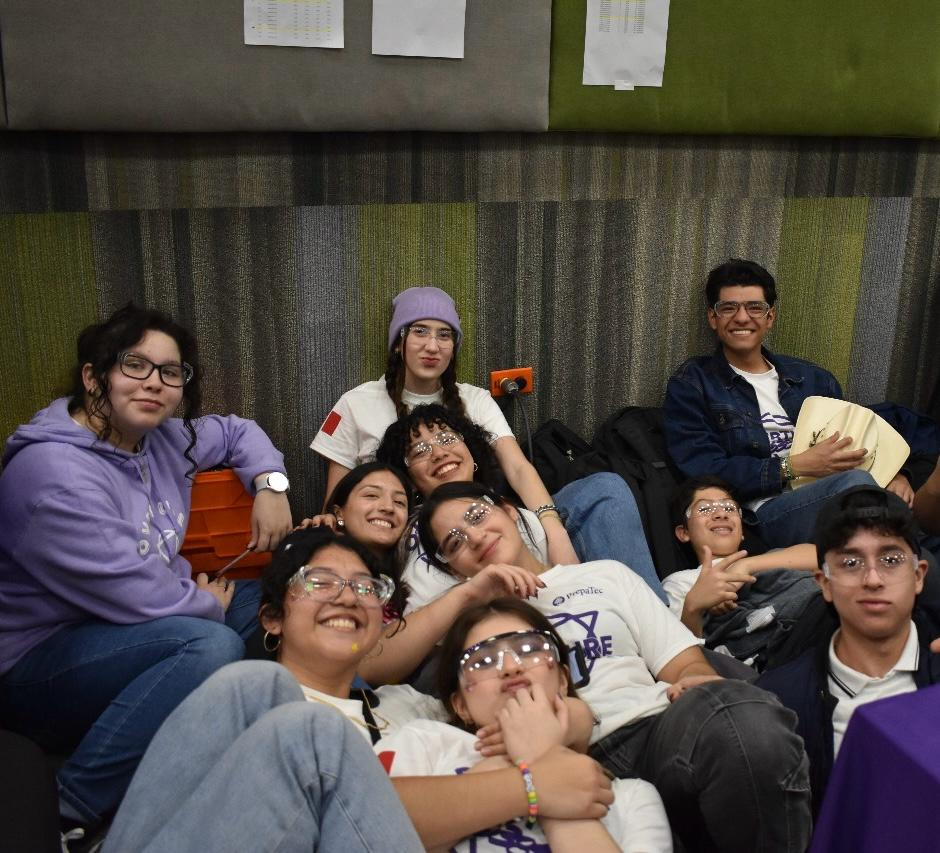
  

  

    
  

  

    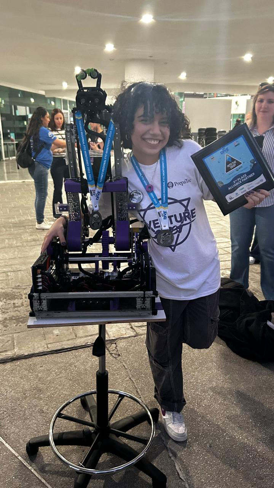
  

---

## **🏁 A Defining Event for Overture & Thanks**

The Monterrey Regional was a pivotal moment for both **Overture Purple** and **Overture White** teams. They are extremely proud of their progress and achievements in their second year in the FTC category. They extend their gratitude to the FTC community, alliance partners **VOLTEC Robotics Black** and **Botbusters White**, all competing teams, judges, volunteers, mentors, coaches, and supporters for their contributions and support. They look forward to continuing their journey towards the Mexico Championship and beyond.

💜⚪ **BELIEVE!** 🚀
